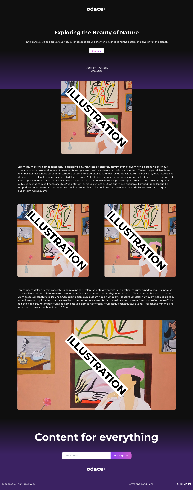

# React + TypeScript + Vite

## Table of contents

- [Overview](#overview)
  - [Features](#Features)
  - [Screenshot](#screenshot)
  - [Links](#links)
- [My process](#my-process)
  - [Built with](#built-with)
- [Author](#author)

## Overview

### Instructions

- Retrieve blogs from a JSON file
- Implement filtering management
- Imagine an UI design based on a sketch

### Screenshot

### Links

- Solution URL: [https://odace-blog.vercel.app/]

## My process

### Built with

- Mobile-first workflow
- [React](https://reactjs.org/) - JS library
- [TailWindcss](https://tailwindcss.com/) - For styles

## Author

- Website - [Théo CHÉRON](https://theo-cheron.fr/)
- Twitter/X - [@vtchrn](https://www.twitter.com/vtchrn)

## Acknowledgments

This is where you can give a hat tip to anyone who helped you out on this project. Perhaps you worked in a team or got some inspiration from someone else's solution. This is the perfect place to give them some credit.

**Note: Delete this note and edit this section's content as necessary. If you completed this challenge by yourself, feel free to delete this section entirely.**
